# Agentic Apartment Manager

## Group Information
**Group Name: Synergy**

### Team Members
- **Maitreya Patankar**
- **Vineet Malewar**
- **David Wang**
- **Jeremy Tung**

---

## Project Summary
The **Agentic Apartment Manager (AAM)** is an autonomous, AI-driven system that functions as a proactive digital property manager for apartment complexes. It receives resident messages, predicts potential problems, simulates solutions, and autonomously executes actions with explainability and observability built in.

---

## System Architecture

The Agentic Apartment Manager is a **microservices-based, event-driven system** that autonomously manages apartment operations using AI agents, RAG (Retrieval-Augmented Generation), and predictive analytics.

### Architecture Overview

```
┌─────────────────────────────────────────────────────────────────┐
│                    PRESENTATION LAYER                            │
│         Resident Portal | Admin Dashboard | Mobile App          │
└───────────────────────────┬─────────────────────────────────────┘
                            │
                            ▼
┌─────────────────────────────────────────────────────────────────┐
│              REQUEST MANAGEMENT SERVICE (8001)                   │
│         API Gateway • Orchestration • Response Aggregation      │
└─────┬─────────────────┬─────────────────┬────────────────────┬──┘
      │                 │                 │                    │
      ▼                 ▼                 ▼                    ▼
┌──────────┐    ┌──────────────┐   ┌────────────┐    ┌──────────┐
│    AI    │    │  DECISION &  │   │ EXECUTION  │    │   DATA   │
│PROCESSING│───▶│ SIMULATION   │──▶│  SERVICE   │───▶│  LAYER   │
│  (8002)  │    │   (8003)     │   │   (8004)   │    │          │
└──────────┘    └──────────────┘   └────────────┘    └──────────┘
Classification   RAG • Simulation   Work Orders      DynamoDB
Intent Det.      Multi-Agent AI     Notifications    ChromaDB
Risk Predict.    Decision Engine    Vendor Mgmt      AWS SQS
```

### Key Components

1. **Request Management (Port 8001)**: API Gateway and orchestration hub
2. **AI Processing (Port 8002)**: Classification, intent detection, risk prediction
3. **Decision & Simulation (Port 8003)**: RAG-enhanced multi-agent decision making
4. **Execution (Port 8004)**: Work order generation and notifications

### Core Technologies
- **Backend**: FastAPI (Python 3.10+)
- **AI/ML**: Google Gemini 2.5 Flash, XGBoost
- **RAG**: ChromaDB (466 documents), SentenceTransformers
- **Data**: AWS DynamoDB, AWS SQS
- **Frontend**: React 18, Vite, Tailwind CSS

### Interactive Architecture Diagram

```mermaid
graph TB
    subgraph Presentation["📱 PRESENTATION LAYER"]
        A1[🌐 Resident Portal]
        A2[📊 Admin Dashboard]
        A3[📱 Mobile App]
    end
    
    subgraph Gateway["� API GATEWAY"]
        B[Request Management Service<br/>Port 8001<br/>Orchestration • Aggregation]
    end
    
    subgraph Services["⚙️ MICROSERVICES"]
        C[🧠 AI Processing<br/>Port 8002<br/>Classification • Intent • Risk]
        D[🤖 Decision & Simulation<br/>Port 8003<br/>RAG • Multi-Agent • Scoring]
        E[✅ Execution<br/>Port 8004<br/>Work Orders • Notifications]
    end
    
    subgraph Data["💾 DATA LAYER"]
        F[(DynamoDB<br/>Requests & Decisions)]
        G[(ChromaDB<br/>466 KB Docs)]
        H[(AWS SQS<br/>Message Queue)]
    end
    
    subgraph External["☁️ EXTERNAL SERVICES"]
        I[Google Gemini API<br/>LLM Processing]
        J[AWS CloudWatch<br/>Logging & Monitoring]
    end
    
    A1 & A2 & A3 -->|REST API| B
    B -->|1. Classify| C
    C -->|2. Simulate| D
    D -->|3. Execute| E
    E -->|4. Complete| B
    
    C -.->|LLM Calls| I
    D -.->|LLM Calls| I
    
    B <-->|Store/Retrieve| F
    C <-->|Risk Data| F
    D <-->|RAG Query| G
    E <-->|Async Jobs| H
    
    B & C & D & E -.->|Logs| J
    
    style Presentation fill:#E3F2FD,stroke:#1976D2,stroke-width:2px
    style Gateway fill:#C8E6C9,stroke:#388E3C,stroke-width:2px
    style C fill:#FFE0B2,stroke:#F57C00,stroke-width:2px
    style D fill:#E1BEE7,stroke:#7B1FA2,stroke-width:2px
    style E fill:#F8BBD0,stroke:#C2185B,stroke-width:2px
    style Data fill:#FFF9C4,stroke:#F57F17,stroke-width:2px
    style External fill:#ECEFF1,stroke:#607D8B,stroke-width:2px
```



�📖 **[View Detailed Architecture](./ARCHITECTURE.md)** - Complete system design, data flows, and technical specifications  
🎨 **[Lucidchart Diagram Guide](./docs/LUCIDCHART_GUIDE.md)** - Instructions for creating professional diagrams

---

## Features

### 🤖 Agentic Intelligence
- **Multi-Agent System**: Coordinated agents for classification, simulation, and decision-making
- **Autonomous Actions**: Self-directed problem resolution with policy compliance
- **Learning Engine**: Continuous improvement from historical decisions

### 🧠 RAG-Enhanced Decision Making
- **Knowledge Base Integration**: 35+ policy documents, SOPs, vendor catalogs, and SLAs
- **Context-Aware Retrieval**: Building-specific and global document filtering
- **Policy Compliance**: Decisions grounded in actual building policies and regulations
- **Citation Tracking**: Full traceability of knowledge sources used in decisions
- **Vector Search**: ChromaDB-powered semantic search with <100ms latency

### 📊 Predictive Analytics
- **Risk Prediction**: XGBoost-based urgency classification
- **Pattern Detection**: ARIMA forecasting for recurring issues
- **Proactive Maintenance**: Identify problems before they escalate

### 🔍 Decision Logging
- **Audit Trail**: Complete decision history in DynamoDB
- **Rule Transparency**: Structured rule objects with policy citations

---

## Project Structure

```
Synergy_CMPE272/
├── services/                 # Microservices
│   ├── request-management/  # Request Management Service
│   │   ├── app/
│   │   ├── Dockerfile
│   │   └── requirements.txt
│   ├── ai-processing/       # AI Processing Service
│   │   ├── app/
│   │   ├── Dockerfile
│   │   └── requirements.txt
│   ├── decision-simulation/ # Decision & Simulation Service
│   │   ├── app/
│   │   ├── Dockerfile
│   │   └── requirements.txt
│   └── execution/           # Execution Service
│       ├── app/
│       ├── Dockerfile
│       └── requirements.txt
│
├── frontend/                # Frontend application
│   ├── src/
│   └── package.json
│
├── ml/                      # Machine learning components
│   ├── scripts/             # Python scripts
│   ├── notebooks/           # Jupyter notebooks
│   ├── data/                # Synthetic datasets
│   └── models/              # Trained models
│
└── infrastructure/          # Infrastructure as code
    ├── docker/              # Docker compose for local testing
    │   └── docker-compose.microservices.yml
```

---

## Getting Started

### Prerequisites
- Docker and Docker Compose installed
- Node.js 18+ and npm 9+
- Python 3.10+ (for local development, optional)
- Google Gemini API key (for AI features)

2. **Run Microservices Locally**
   ```bash
   # Request Management
   cd services/request-management
   docker build -t request-management .
   docker run -p 8001:8001 request-management
   
   # AI Processing
   cd services/ai-processing
   docker build -t ai-processing .
   docker run -p 8002:8002 ai-processing
   
   # Decision & Simulation (needs ChromaDB)
   cd services/decision-simulation
   docker build -t decision-simulation .
   docker run -p 8003:8003 -v $(pwd)/vector_stores:/app/vector_stores decision-simulation
   
   # Execution
   cd services/execution
   docker build -t execution .
   docker run -p 8004:8004 execution
   ```

---

## 🧪 Local Testing (End-to-End from UI)

Complete guide to test all microservices locally with the frontend.

### Step 1: Clone and Navigate to Project

```bash
git clone https://github.com/vintu2001/Synergy_CMPE272.git
cd Synergy_CMPE272
```

### Step 2: Create Environment File

```bash
cd infrastructure/docker
cp .env.example .env
```

Edit `.env` file with your configuration:

```bash
# Required
GEMINI_API_KEY=your_gemini_api_key_here

# AWS (optional for local testing, required for production features)
AWS_REGION=us-west-2
AWS_ACCESS_KEY_ID=your_aws_access_key
AWS_SECRET_ACCESS_KEY=your_aws_secret_key
AWS_DYNAMODB_TABLE_NAME=aam_requests
AWS_SQS_QUEUE_URL=your_sqs_queue_url

# Admin API Key (for admin endpoints)
ADMIN_API_KEY=test-admin-key-change-in-production
```

### Step 3: Start All Microservices

```bash
# From infrastructure/docker directory
docker-compose -f docker-compose.microservices.yml up -d
```

This starts:
- **Request Management Service** on port `8001`
- **AI Processing Service** on port `8002`
- **Decision & Simulation Service** on port `8003`
- **Execution Service** on port `8004`

**Wait 30-60 seconds** for all services to start.

### Step 4: Verify Services Are Running

```bash
# Check all services are healthy
curl http://localhost:8001/health
curl http://localhost:8002/health
curl http://localhost:8003/health
curl http://localhost:8004/health
```

Expected response: `{"status":"healthy","service":"..."}`

### Step 5: Initialize ChromaDB (First Time Only)

The Decision & Simulation service needs ChromaDB populated with knowledge base documents:

```bash
# Run ingestion inside the container
docker exec -it decision-simulation-service python app/kb/ingest_documents.py
```

**Time:** 5-10 minutes (downloads embedding model and processes documents)

**Verify ingestion:**
```bash
docker exec decision-simulation-service python -c "import chromadb; print('Documents:', chromadb.PersistentClient(path='/app/vector_stores/chroma_db').get_or_create_collection('apartment_kb').count())"
```

Expected: 400-500+ documents

### Step 6: Start Frontend

Open a **new terminal**:

```bash
cd frontend

# Install dependencies (first time only)
npm install

# Start development server
npm run dev
```

Frontend will be available at: `http://localhost:5173`

### Step 7: Test from UI

1. **Open browser:** `http://localhost:5173`

2. **Select a resident** (or use default: `RES_Building123_1001`)

3. **Submit a test request:**
   - **Maintenance:** "My AC is broken and it's very hot outside"
   - **Question:** "What is the parking policy for guests?"
   - **Billing:** "I have a question about my rent payment"

4. **Verify behavior:**
   - Classification happens automatically as you type (after 2 seconds)
   - Submit button is disabled while classifying
   - Options are generated based on category/urgency
   - For questions, direct answer is shown (not options)
   - Source documents are displayed for RAG answers

### Step 8: Check Service Logs (Optional)

```bash
# View all service logs
cd infrastructure/docker
docker-compose -f docker-compose.microservices.yml logs -f

# View specific service logs
docker-compose -f docker-compose.microservices.yml logs -f request-management
docker-compose -f docker-compose.microservices.yml logs -f ai-processing
docker-compose -f docker-compose.microservices.yml logs -f decision-simulation
```

### Step 9: Test API Endpoints Directly

**Classify a message:**
```bash
curl -X POST http://localhost:8001/api/v1/classify \
  -H "Content-Type: application/json" \
  -d '{
    "resident_id": "RES_Building123_1001",
    "message_text": "My AC is broken"
  }'
```

**Submit a full request:**
```bash
curl -X POST http://localhost:8001/api/v1/submit-request \
  -H "Content-Type: application/json" \
  -d '{
    "resident_id": "RES_Building123_1001",
    "message_text": "My AC is broken and it'\''s very hot outside"
  }'
```

### Step 10: Stop Services

```bash
# Stop all services
cd infrastructure/docker
docker-compose -f docker-compose.microservices.yml down

# Stop and remove volumes (clears ChromaDB data)
docker-compose -f docker-compose.microservices.yml down -v
```

### Troubleshooting

**Issue: Services won't start**
- Check Docker is running: `docker ps`
- Check ports 8001-8004 are not in use
- Check `.env` file exists and has required variables

**Issue: ChromaDB is empty**
- Run ingestion: `docker exec -it decision-simulation-service python app/kb/ingest_documents.py`
- Check KB files are mounted: `docker exec decision-simulation-service ls -la /app/kb`

**Issue: Frontend can't connect to backend**
- Verify services are running: `curl http://localhost:8001/health`
- Check frontend `.env` has: `VITE_API_BASE_URL=http://localhost:8001`
- Check browser console for CORS errors

**Issue: Classification not working**
- Check GEMINI_API_KEY is set in `.env`
- Check AI Processing service logs: `docker-compose logs ai-processing`
- Verify service is healthy: `curl http://localhost:8002/health`

**Issue: RAG not finding documents**
- Verify ChromaDB has documents (Step 5)
- Check RAG_ENABLED=true in Decision & Simulation service
- Check logs: `docker-compose logs decision-simulation | grep -i rag`


---

## Resources

- [FastAPI Documentation](https://fastapi.tiangolo.com/)
- [Docker Documentation](https://docs.docker.com/)
- [React Documentation](https://react.dev/)
- [ChromaDB Documentation](https://docs.trychroma.com/)
