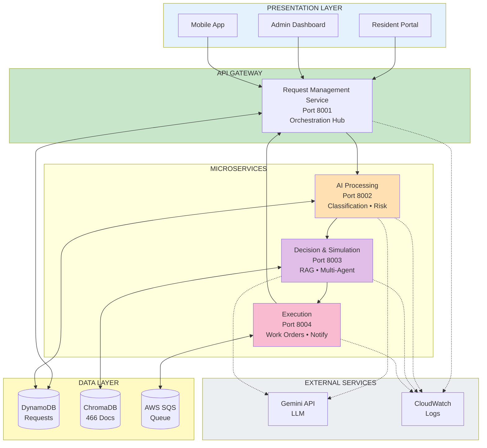

# Lucidchart Architecture Diagram

## How to Create the Diagram in Lucidchart

1. Go to [Lucidchart](https://www.lucidchart.com/)
2. Create a new document
3. Use the following components and layout:

---

## Diagram Layout Specification

### Layer 1: Presentation Layer (Top)
**Components:**
- Rectangle: "Resident Portal" (Web icon)
- Rectangle: "Admin Dashboard" (Dashboard icon)
- Rectangle: "Mobile App" (Phone icon)
- Group these in a container labeled "PRESENTATION LAYER"
- Color: Light Blue (#E3F2FD)

### Layer 2: API Gateway (Below Presentation)
**Components:**
- Large rectangle: "REQUEST MANAGEMENT SERVICE"
  - Port: 8001
  - Sub-components:
    - Message Ingestion
    - Request Orchestration
    - Response Aggregation
- Color: Green (#C8E6C9)
- Add bidirectional arrows from Presentation Layer

### Layer 3: Microservices (Horizontal Row)
**Components:**

1. **AI Processing Service**
   - Rectangle with rounded corners
   - Port: 8002
   - Icon: Brain/AI symbol
   - Sub-items (bullets):
     - Message Classification
     - Intent Detection
     - Risk Prediction
     - Gemini LLM Integration
   - Color: Orange (#FFE0B2)

2. **Decision & Simulation Service**
   - Rectangle with rounded corners
   - Port: 8003
   - Icon: Decision tree/Network
   - Sub-items (bullets):
     - RAG Retrieval (ChromaDB)
     - Multi-Agent Simulation
     - Policy Scoring
     - Decision Engine
   - Color: Purple (#E1BEE7)

3. **Execution Service**
   - Rectangle with rounded corners
   - Port: 8004
   - Icon: Checkmark/Action
   - Sub-items (bullets):
     - Work Order Generation
     - Notification Delivery
     - Vendor Coordination
     - SQS Message Processing
   - Color: Pink (#F8BBD0)

**Arrows:**
- Request Management → AI Processing (numbered "1")
- AI Processing → Decision & Simulation (numbered "2")
- Decision & Simulation → Execution (numbered "3")
- Execution → Request Management (numbered "4" - completion)

### Layer 4: Data Layer (Bottom)
**Components:**
- Rectangle: "AWS DynamoDB"
  - Icon: Database
  - Label: "Requests, Decisions, Audit Trail"
  - Color: Yellow (#FFF9C4)

- Rectangle: "ChromaDB Vector Store"
  - Icon: Search/Vector
  - Label: "466 Documents: Policies, SOPs, Catalogs, SLAs"
  - Color: Teal (#B2DFDB)

- Rectangle: "AWS SQS Queue"
  - Icon: Queue/Message
  - Label: "Async Job Processing"
  - Color: Blue (#BBDEFB)

**Arrows:**
- All microservices have bidirectional arrows to their respective data stores

### Layer 5: External Services (Side Panel)
**Components:**
- Rectangle: "Google Gemini API"
  - Label: "LLM for Classification & Simulation"
  - Icon: AI/Google logo
  - Color: Light Grey (#ECEFF1)

- Rectangle: "AWS CloudWatch"
  - Label: "Logging & Monitoring"
  - Icon: Cloud/Monitor
  - Color: Light Grey (#ECEFF1)

**Arrows:**
- Dotted lines from AI Processing and Decision services to Gemini
- Dotted lines from all services to CloudWatch

### Layer 6: Monitoring (Bottom Right)
**Components:**
- Rectangle: "CloudWatch Logs"
- Rectangle: "Grafana Dashboards"
- Rectangle: "Instana APM"
- Group in container labeled "MONITORING & OBSERVABILITY"
- Color: Red (#FFCDD2)

---

## Data Flow Annotations

Add numbered flow indicators:
1. **Resident Request** → Request Management
2. **Classification** → AI Processing
3. **Simulation** → Decision Service
4. **Decision** → Policy Scoring
5. **Execution** → Work Order Creation
6. **Response** → Back to Resident

Add text annotations for key processes:
- "RAG: 5 docs retrieved in <100ms"
- "3 options generated using 8 agent tools"
- "Policy scores: opt_1: 0.95, opt_2: 0.89, opt_3: 0.82"
- "Total processing: 15-35 seconds"

---

## Color Scheme

| Component Type | Color Code | Hex |
|---------------|-----------|-----|
| Presentation | Light Blue | #E3F2FD |
| API Gateway | Green | #C8E6C9 |
| AI Processing | Orange | #FFE0B2 |
| Decision & Sim | Purple | #E1BEE7 |
| Execution | Pink | #F8BBD0 |
| Data Layer | Yellow/Teal/Blue | #FFF9C4/#B2DFDB/#BBDEFB |
| External | Light Grey | #ECEFF1 |
| Monitoring | Red | #FFCDD2 |

---

## Icons to Use

- 🌐 Web Browser (Presentation)
- 📱 Mobile Phone (Mobile App)
- 📊 Dashboard (Admin)
- 🔄 Gateway (API Gateway)
- 🧠 Brain (AI Processing)
- 🤖 Robot (Agents)
- 🎯 Target (Decision)
- ✅ Checkmark (Execution)
- 💾 Database (DynamoDB)
- 🔍 Search (ChromaDB)
- 📨 Message Queue (SQS)
- ☁️ Cloud (CloudWatch)
- 📈 Chart (Monitoring)

---

## Alternative: Mermaid Diagram (for GitHub)

If you prefer a text-based diagram that renders on GitHub, use this Mermaid code:



---

## Embedding in Documentation

### Option 1: Lucidchart Embed
1. Create diagram in Lucidchart
2. Click Share → Embed
3. Copy the iframe code
4. Add to README.md as HTML:

```html
<iframe width="800" height="600" src="https://lucid.app/documents/embedded/..." frameborder="0" allowfullscreen></iframe>
```

### Option 2: Static Image
1. Export from Lucidchart as PNG (high resolution)
2. Save to `/docs/images/architecture.png`
3. Add to README.md:

```markdown

```

### Option 3: Mermaid (Recommended for GitHub)
- Add the mermaid code block directly to README.md
- GitHub automatically renders it

---

## Quick Start with Lucidchart

1. **Create New Document**: Start with "Blank" or "Cloud Architecture" template
2. **Add Shapes**: Use AWS shapes library + standard flowchart shapes
3. **Follow Layout**: Top to bottom: Presentation → Gateway → Services → Data
4. **Color Code**: Apply the color scheme from the table above
5. **Add Arrows**: Show data flow with directional arrows
6. **Label Everything**: Add port numbers, component names, descriptions
7. **Export**: Save as PNG and embed in README

---

**Created:** November 17, 2025  
**For:** Agentic Apartment Manager Documentation  
**Team:** Synergy
